# Knowledge Base RAG Pipeline

This project is a small Retrieval-Augmented Generation, or RAG, pipeline built with Python, pandas, scikit-learn, and OpenAI.

The app reads article content from a CSV file, splits the text into chunks, creates embeddings for every chunk, retrieves the chunks most similar to a user question, and sends the retrieved context to `gpt-4o-mini` to generate an answer.

## Setup

Create and activate a virtual environment:

```bash
python3 -m venv .myenv
source .myenv/bin/activate
```

Install dependencies:

```bash
python3 -m pip install -r requirements.txt
```

Create your local `.env` file from the example:

```bash
cp .env.example .env
```

Then edit `.env` and add your real OpenAI API key:

```env
OPENAI_API_KEY=your_openai_api_key_here
OPENAI_CHAT_MODEL=gpt-4o-mini
```

Run the main script:

```bash
python app.py
```

Security note: never commit the real `.env` file. It contains private API keys and is ignored by `.gitignore`.

## Big Picture

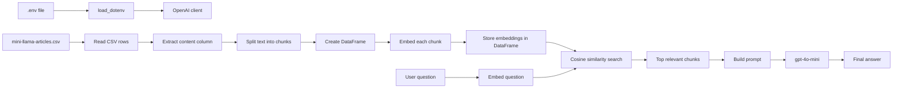

The pipeline has two phases:

1. Indexing: convert document chunks into embedding vectors.
2. Retrieval and generation: embed the question, find relevant chunks, and ask the chat model to answer using those chunks.

## Environment Loading

The OpenAI client needs an API key. The project loads that key from `.env`.

```python
from dotenv import load_dotenv
from openai import OpenAI

load_dotenv()
OPENAI_CHAT_MODEL = os.getenv("OPENAI_CHAT_MODEL", "gpt-4o-mini")

client = OpenAI()
```

The order matters. `load_dotenv()` must run before the code depends on environment variables.

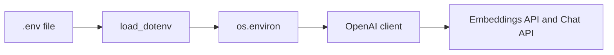

`OPENAI_API_KEY` is read automatically by `OpenAI()`. `OPENAI_CHAT_MODEL` is read manually so you can switch the answer model without changing code.

## Dataset

The CSV file is:

```text
mini-llama-articles.csv
```

The dataset has 14 rows and 4 columns:

```text
title
content
url
source
```

Example row:

```text
title   -> "Beyond GPT-4: What's New?"
content -> "LLM Variants and Meta's Open Source Before shedding light..."
url     -> "https://pub.towardsai.net/..."
source  -> "towards_ai"
```

The current code only uses the `content` column:

```python
row[1]
```

Because the CSV columns are ordered as:

```text
0 -> title
1 -> content
2 -> url
3 -> source
```

## Reading The CSV

Code:

```python
chunks = []

with open("./mini-llama-articles.csv", mode="r", encoding="utf-8") as file:
    csv_reader = csv.reader(file)

    for idx, row in enumerate(csv_reader):
        if idx == 0:
            continue

        chunks.extend(split_into_chunks(row[1]))
```

Pipeline:

```mermaid
flowchart TD
    A[Open mini-llama-articles.csv] --> B[csv.reader]
    B --> C[Loop over rows]
    C --> D{idx == 0?}
    D -->|Yes| E[Skip header row]
    D -->|No| F[Take row[1] = content]
    F --> G[split_into_chunks content]
    G --> H[Extend global chunks list]
```

Input example:

```python
row = [
    "Beyond GPT-4: What's New?",
    "LLM Variants and Meta's Open Source Before shedding light...",
    "https://pub.towardsai.net/...",
    "towards_ai"
]
```

Output:

```python
"LLM Variants and Meta's Open Source Before shedding light..."
```

## Splitting Text Into Chunks

Code:

```python
def split_into_chunks(text, chunk_size=1024):
    chunks = []

    for i in range(0, len(text), chunk_size):
        chunks.append(text[i: i+chunk_size])

    return chunks
```

The function receives one long text and returns smaller text pieces.

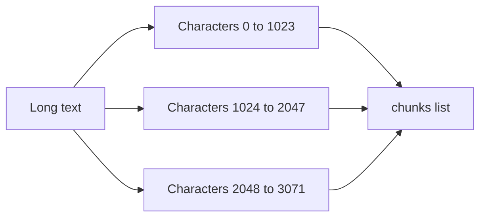

Simulation:

```python
text = "ABCDEFGHIJ"
chunk_size = 4
```

Loop behavior:

```text
i = 0  -> text[0:4]  -> "ABCD"
i = 4  -> text[4:8]  -> "EFGH"
i = 8  -> text[8:12] -> "IJ"
```

Output:

```python
["ABCD", "EFGH", "IJ"]
```

In the real project, the default chunk size is `1024`, so each chunk is up to 1024 characters.

Important limitation: this splits by characters, not words, sentences, or tokens. That is simple, but it can cut a sentence in the middle.

## What Is A DataFrame?

A pandas DataFrame is a table in memory. It has rows and columns, like a spreadsheet or SQL table.

Before creating the DataFrame:

```python
chunks = [
    "LLM Variants and Meta's Open Source...",
    "From LLMs to Multimodal LLMs...",
    "From Connections to Vector DB..."
]
```

The code creates a DataFrame:

```python
df = pd.DataFrame(chunks, columns=['chunk'])
```

After that:

```text
index | chunk
------+---------------------------------------
0     | LLM Variants and Meta's Open Source...
1     | From LLMs to Multimodal LLMs...
2     | From Connections to Vector DB...
```

Diagram:

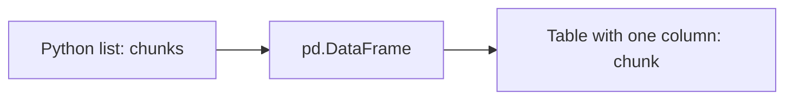

The DataFrame is useful because each chunk becomes a row. Later, the code adds the embedding vector beside the chunk text.

## Creating Embeddings

Code:

```python
def get_embedding(text):
    try:
        text = text.replace('\n', ' ')
        res = client.embeddings.create(
            input=[text],
            model="text-embedding-3-small"
        )
        return res.data[0].embedding
    except Exception as e:
        raise RuntimeError(f"Failed to create embedding: {e}") from e
```

An embedding is a list of numbers that represents the meaning of a piece of text.

Conceptual example:

```python
text = "LLaMA2 has 7B to 70B parameters"
```

Output shape:

```python
[
    0.012,
    -0.044,
    0.105,
    ...
]
```

You do not read these numbers manually. They are useful because similar meanings usually produce vectors that are mathematically close to each other.

Diagram:

```mermaid
flowchart TD
    A[Input text] --> B[Replace newlines with spaces]
    B --> C[OpenAI embeddings API]
    C --> D[Embedding response]
    D --> E[res.data[0].embedding]
    E --> F[List of numbers]
```

## Generating Embeddings For Every Chunk

Code:

```python
print("Generating embeddings")
embeddings = []

for index, row in tqdm(df.iterrows(), total=len(df)):
    embeddings.append(get_embedding(row['chunk']))
```

Before the loop:

```text
df

index | chunk
------+-----------------------------
0     | LLM Variants and Meta...
1     | From LLMs to Multimodal...
2     | From Connections to Vector DB...
```

Loop simulation:

```text
row 0 chunk -> get_embedding(...) -> embedding_0
row 1 chunk -> get_embedding(...) -> embedding_1
row 2 chunk -> get_embedding(...) -> embedding_2
```

After the loop:

```python
embeddings = [
    embedding_0,
    embedding_1,
    embedding_2
]
```

Diagram:

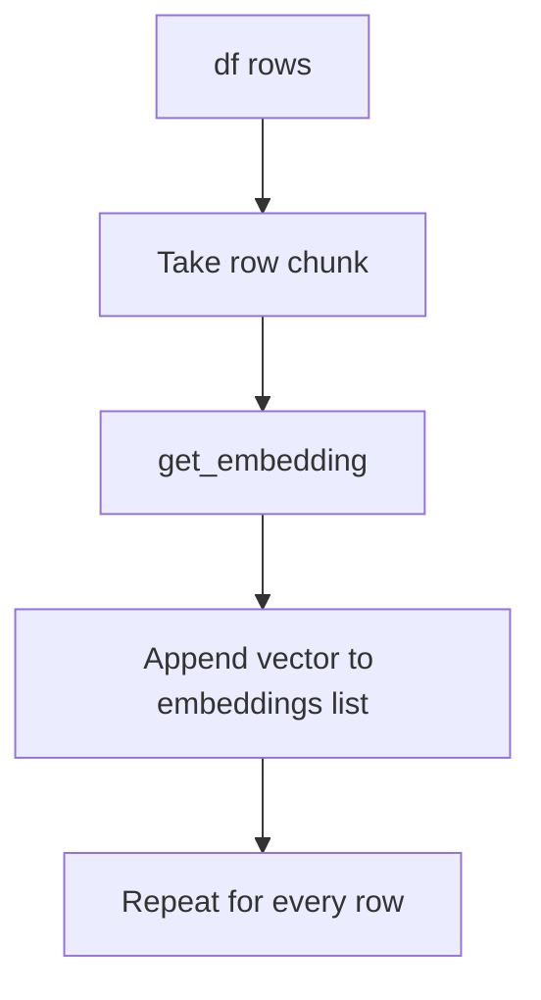

`tqdm` only shows a progress bar in the terminal.

## Inserting Embeddings Into The DataFrame

Code:

```python
embedding_values = pd.Series(embeddings)
df.insert(loc=1, column='embedding', value=embedding_values)
```

`pd.Series` is like one DataFrame column.

Before insert:

```text
index | chunk
------+-----------------------------
0     | chunk text 0
1     | chunk text 1
2     | chunk text 2
```

Embeddings:

```python
[
    [0.01, -0.03, ...],
    [0.04, 0.11, ...],
    [-0.02, 0.07, ...]
]
```

After insert:

```text
index | chunk        | embedding
------+--------------+-------------------------
0     | chunk text 0 | [0.01, -0.03, ...]
1     | chunk text 1 | [0.04, 0.11, ...]
2     | chunk text 2 | [-0.02, 0.07, ...]
```

Diagram:

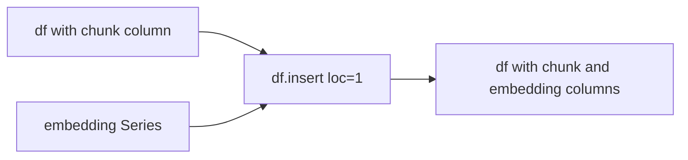

`loc=1` means insert the new column at position 1, right after `chunk`.

## Embedding The Question

Code:

```python
QUESTION = "How many parameters does the LLaMA2 model have?"
QUESTION_EMB = get_embedding(QUESTION)
```

The question becomes a vector using the same embedding model as the chunks.


This matters because retrieval compares vectors. Chunk embeddings and question embeddings must live in the same vector space.

## Similarity Search

Code:

```python
similarities = cosine_similarity([QUESTION_EMB], df['embedding'].tolist())
```

`cosine_similarity` compares the question embedding against every chunk embedding.

Example:

```python
similarities = [[
    0.12,  # chunk 0
    0.87,  # chunk 1
    0.34,  # chunk 2
    0.91,  # chunk 3
]]
```

Higher score means more similar meaning.

Diagram:

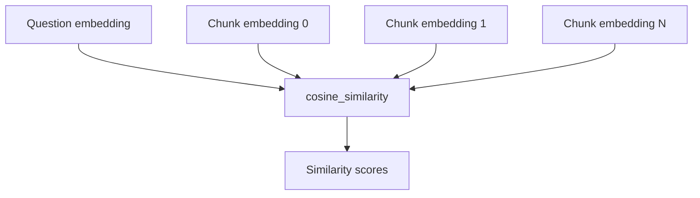

## Selecting The Best Chunks

Code:

```python
number_of_chunks_to_retrieve = 3
indices = np.argsort(similarities[0])[::-1][:number_of_chunks_to_retrieve]
```

Step by step:

```python
similarities[0]
```

Gets the actual score list:

```python
[0.12, 0.87, 0.34, 0.91]
```

```python
np.argsort(similarities[0])
```

Returns indexes sorted from lowest score to highest score:

```python
[0, 2, 1, 3]
```

```python
[::-1]
```

Reverses the order so best scores come first:

```python
[3, 1, 2, 0]
```

```python
[:number_of_chunks_to_retrieve]
```

Keeps only the top N:

```python
[3, 1, 2]
```

Those are DataFrame row positions for the most relevant chunks.

Diagram:

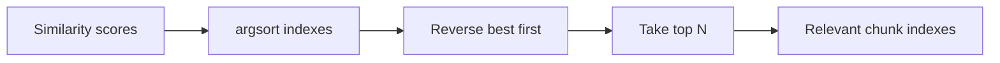

## Building The Context

Code:

```python
retrieved_context = " ".join(df.iloc[indices]["chunk"])
prompt = prompt.format(retrieved_context, QUESTION)
```

`df.iloc[indices]["chunk"]` means:

```text
Take the chunk column from the rows selected by the retrieval indexes.
```

Example:

```python
indices = [3, 1, 2]
```

Then:

```python
df.iloc[indices]["chunk"]
```

returns the text from rows 3, 1, and 2.

`" ".join(...)` combines those chunks into one context string.

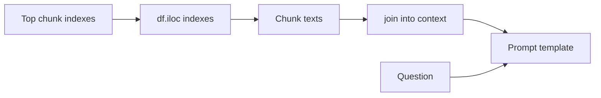

## Asking GPT-4o Mini

Code:

```python
response = client.chat.completions.create(
    model=OPENAI_CHAT_MODEL,
    messages=[
        {"role": "system", "content": system_prompt},
        {"role": "user", "content": prompt},
    ],
)

print(response.choices[0].message.content)
```

The chat model receives:

```text
system message -> how the assistant should behave
user message   -> retrieved context plus the user question
```

Diagram:

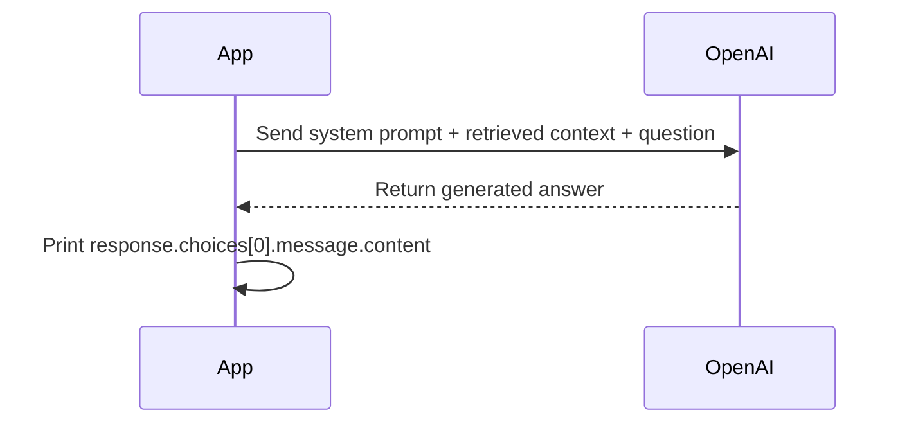

Example output from a successful run:

```text
The LLaMA 2 model is available in four different sizes with the following parameters: 7 billion, 13 billion, 34 billion, and 70 billion.
```

## Full RAG Flow

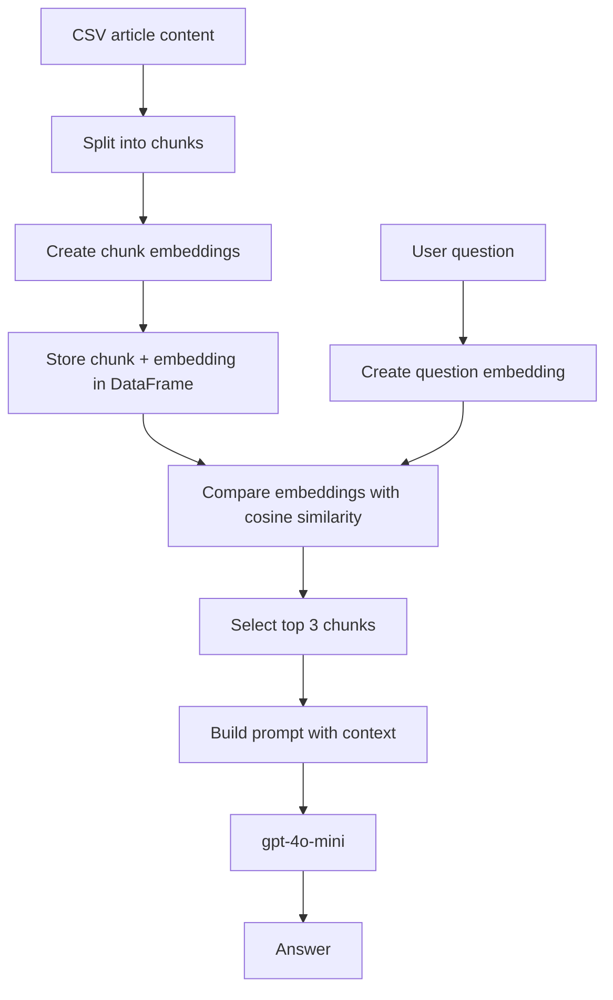

## Mental Model

Think of the pipeline like this:

```text
CSV article text
    -> split into smaller pieces
    -> store pieces in a table
    -> convert each piece into numbers
    -> convert the user question into numbers
    -> compare question numbers with chunk numbers
    -> retrieve the closest chunks
    -> send those chunks to gpt-4o-mini
    -> print the answer
```

The key idea is that embeddings let you compare meaning, not exact words.

A question about `LLaMA2 parameters` can match a chunk that says `7 billion to 70 billion` even if the wording is different.

## Code Review Notes

### 1. The Script Recomputes Embeddings Every Run

The app currently creates embeddings for all chunks every time you run it.

That is simple for learning, but inefficient and more expensive than necessary. A better next step is to save embeddings locally in a file, or store them in a vector database.

### 2. Character-Based Chunking Is Simple But Limited

This code splits every 1024 characters:

```python
text[i: i+chunk_size]
```

That can cut words or sentences in the middle.

Later, a better chunking strategy could split by:

- paragraphs
- sentences
- tokens
- overlapping windows

### 3. Metadata Is Missing From The DataFrame

The current DataFrame only stores:

```text
chunk
embedding
```

For a production RAG system, you usually also want:

```text
chunk
embedding
title
url
source
```

That way, when the system retrieves an answer, you know where the answer came from.

### 4. `read_data.py` Is Separate From The Main Pipeline

`read_data.py` downloads the CSV from GitHub and renders a preview table using Rich.

It does not save the dataset locally, and it is not currently imported by `app.py`.

## Recommended Next Steps

1. Cache embeddings so you do not pay to recreate them on every run.
2. Store metadata like `title`, `url`, and `source` with every chunk.
3. Turn the script into functions so each stage can be tested independently.
4. Add a command-line input so users can ask different questions.
5. Add basic tests for chunking, retrieval ordering, and prompt construction.
