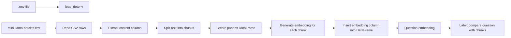
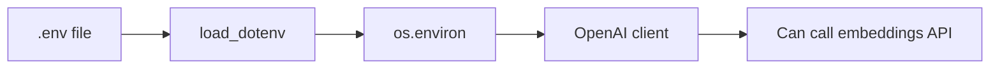
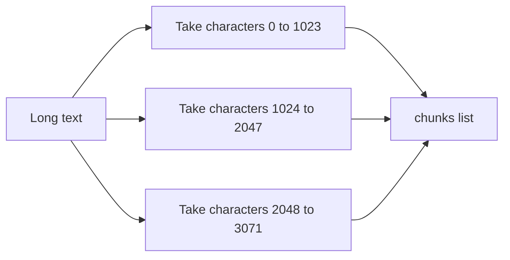
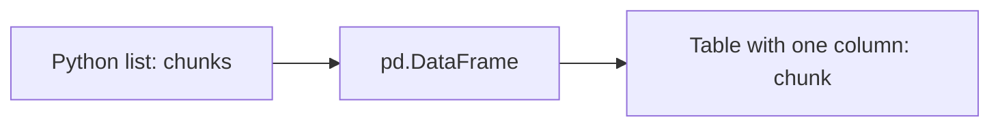
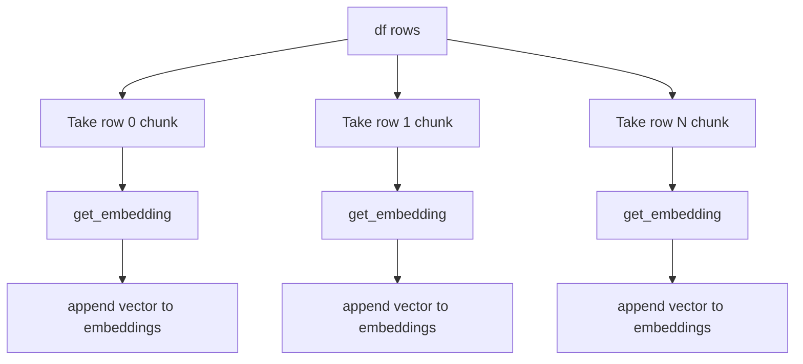
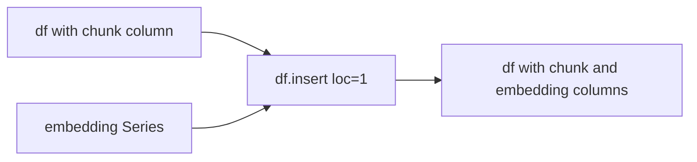
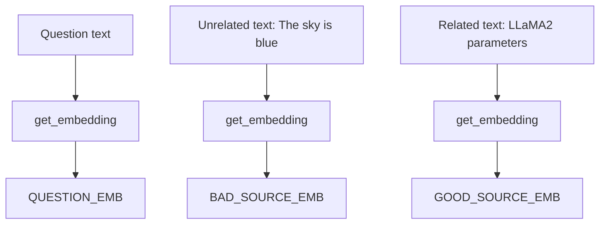
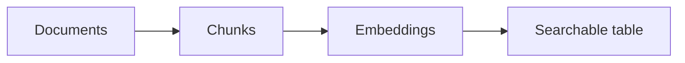
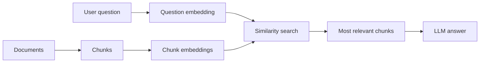

# Knowledge Base RAG Pipeline

This project builds the first half of a Retrieval-Augmented Generation, or RAG, pipeline.

The code reads articles from a CSV file, splits long article text into smaller chunks, creates embeddings for each chunk using OpenAI, and stores the text chunks and their embeddings in a pandas DataFrame.

## Setup

Create and activate a virtual environment:

```bash
python3 -m venv .myenv
source .myenv/bin/activate
```

Install dependencies:

```bash
python3 -m pip install -r requirements.txt
```

Create your local `.env` file from the example:

```bash
cp .env.example .env
```

Then edit `.env` and add your real API keys:

```env
OPENAI_API_KEY=your_openai_api_key_here
OPENAI_CHAT_MODEL=gpt-4o-mini
```

Run the main script:

```bash
python app.py
```

Security note: never commit the real `.env` file. It contains private API keys and is ignored by `.gitignore`.

## Big Picture



The current pipeline prepares your knowledge base for semantic search.

It does not yet complete the full RAG process. The next step would be to compare the user question embedding against the chunk embeddings, retrieve the most relevant chunks, and send those chunks to a language model to generate an answer.

## Environment Loading

The OpenAI client needs an API key. The project loads that key from a `.env` file.

```python
from dotenv import load_dotenv
from openai import OpenAI

load_dotenv()

client = OpenAI()
```

Your `.env` file should contain:

```env
OPENAI_API_KEY=your_api_key_here
```

The order matters. `load_dotenv()` must run before `client = OpenAI()`.



`load_dotenv()` reads the `.env` file and places the variables into the process environment. `OpenAI()` then automatically looks for `OPENAI_API_KEY`.

## Dataset

The CSV file is:

```text
mini-llama-articles.csv
```

The dataset has 14 rows and 4 columns:

```text
title
content
url
source
```

Example row:

```text
title   -> "Beyond GPT-4: What's New?"
content -> "LLM Variants and Meta's Open Source Before shedding light..."
url     -> "https://pub.towardsai.net/..."
source  -> "towards_ai"
```

The current code only uses the `content` column:

```python
row[1]
```

Because the CSV columns are ordered as:

```text
0 -> title
1 -> content
2 -> url
3 -> source
```

## Reading The CSV

Code:

```python
chunks = []

with open("./mini-llama-articles.csv", mode="r", encoding="utf-8") as file:
    csv_reader = csv.reader(file)

    for idx, row in enumerate(csv_reader):
        if idx == 0:
            continue

        chunks.extend(split_into_chunks(row[1]))
```

Pipeline:

```mermaid
flowchart TD
    A[Open mini-llama-articles.csv] --> B[csv.reader]
    B --> C[Loop over rows]
    C --> D{idx == 0?}
    D -->|Yes| E[Skip header row]
    D -->|No| F[Take row[1] = content]
    F --> G[split_into_chunks content]
    G --> H[Extend global chunks list]
```

Input example:

```python
row = [
    "Beyond GPT-4: What's New?",
    "LLM Variants and Meta's Open Source Before shedding light...",
    "https://pub.towardsai.net/...",
    "towards_ai"
]
```

The code takes:

```python
row[1]
```

Output:

```python
"LLM Variants and Meta's Open Source Before shedding light..."
```

## Splitting Text Into Chunks

Code:

```python
def split_into_chunks(text, chunk_size=1024):
    chunks = []

    for i in range(0, len(text), chunk_size):
        chunks.append(text[i: i+chunk_size])

    return chunks
```

The function receives one long text and returns a list of smaller text pieces.



Simulation:

```python
text = "ABCDEFGHIJ"
chunk_size = 4
```

Loop behavior:

```text
i = 0  -> text[0:4]  -> "ABCD"
i = 4  -> text[4:8]  -> "EFGH"
i = 8  -> text[8:12] -> "IJ"
```

Output:

```python
["ABCD", "EFGH", "IJ"]
```

In the real project, the default chunk size is `1024`, so each chunk is up to 1024 characters.

Important limitation: this splits by characters, not words, sentences, or tokens. That is simple, but it can cut a sentence in the middle.

## What Is A DataFrame?

A pandas DataFrame is a table in memory.

It has rows and columns, like a spreadsheet or SQL table.

Before creating the DataFrame, the data is a Python list:

```python
chunks = [
    "LLM Variants and Meta's Open Source...",
    "From LLMs to Multimodal LLMs...",
    "From Connections to Vector DB..."
]
```

The code creates a DataFrame:

```python
df = pd.DataFrame(chunks, columns=['chunk'])
```

After that, the data looks like this:

```text
index | chunk
------+---------------------------------------
0     | LLM Variants and Meta's Open Source...
1     | From LLMs to Multimodal LLMs...
2     | From Connections to Vector DB...
```

Diagram:



The DataFrame is useful because it keeps each text chunk in a structured row. Later, the code can add another column beside each chunk: the embedding vector.

## Creating Embeddings

Code:

```python
def get_embedding(text):
    try:
        text = text.replace('\n', ' ')
        res = client.embeddings.create(
            input=[text],
            model="text-embedding-3-small"
        )
        return res.data[0].embedding
    except:
        return None
```

An embedding is a list of numbers that represents the meaning of a piece of text.

Conceptual example:

```python
text = "LLaMA2 has 7B to 70B parameters"
```

Output shape:

```python
[
    0.012,
    -0.044,
    0.105,
    ...
]
```

You do not read these numbers manually. They are useful because similar meanings usually produce vectors that are mathematically close to each other.

Diagram:

```mermaid
flowchart TD
    A[Input text] --> B[Replace newlines with spaces]
    B --> C[Send to OpenAI embeddings API]
    C --> D[API returns embedding response]
    D --> E[Take res.data[0].embedding]
    E --> F[List of numbers]
```

Input/output example:

```python
get_embedding("The sky is blue")
```

Returns something like:

```python
[0.021, -0.018, 0.004, ...]
```

The real vector is longer and comes from OpenAI.

## Generating Embeddings For Every Chunk

Code:

```python
print("Generating embeddings")
embeddings = []

for index, row in tqdm(df.iterrows(), total=len(df)):
    embeddings.append(get_embedding(row['chunk']))
```

Before the loop:

```text
df

index | chunk
------+-----------------------------
0     | LLM Variants and Meta...
1     | From LLMs to Multimodal...
2     | From Connections to Vector DB...
```

Loop simulation:

```text
row 0 chunk -> get_embedding(...) -> embedding_0
row 1 chunk -> get_embedding(...) -> embedding_1
row 2 chunk -> get_embedding(...) -> embedding_2
```

After the loop:

```python
embeddings = [
    embedding_0,
    embedding_1,
    embedding_2
]
```

Diagram:



`tqdm` shows a progress bar in the terminal. It does not change the data.

## Inserting Embeddings Into The DataFrame

Code:

```python
embedding_values = pd.Series(embeddings)
df.insert(loc=1, column='embedding', value=embedding_values)
```

`pd.Series` is like one DataFrame column.

Before insert:

```text
df

index | chunk
------+-----------------------------
0     | chunk text 0
1     | chunk text 1
2     | chunk text 2
```

Embeddings:

```python
[
    [0.01, -0.03, ...],
    [0.04, 0.11, ...],
    [-0.02, 0.07, ...]
]
```

After insert:

```text
df

index | chunk        | embedding
------+--------------+-------------------------
0     | chunk text 0 | [0.01, -0.03, ...]
1     | chunk text 1 | [0.04, 0.11, ...]
2     | chunk text 2 | [-0.02, 0.07, ...]
```

Diagram:



`loc=1` means insert the new column at position 1, right after `chunk`.

## Question Embeddings

Code:

```python
QUESTION = "How many parameters does the LLaMA2 model have?"

QUESTION_EMB = get_embedding(QUESTION)
BAD_SOURCE_EMB = get_embedding("The Sky is Blue")
GOOD_SOURCE_EMB = get_embedding('LLaMA2 model has a total of 2B parameters.')
```

This creates embeddings for three separate texts:



The likely next step is to compare these vectors using cosine similarity:

```python
cosine_similarity([QUESTION_EMB], [GOOD_SOURCE_EMB])
cosine_similarity([QUESTION_EMB], [BAD_SOURCE_EMB])
```

Expected result:

```text
question vs good source -> higher similarity
question vs bad source  -> lower similarity
```

This is the core idea behind retrieval in RAG.

## Current RAG Stage

Your code currently implements this:



A fuller RAG system would look like this:



Your current code stops before the real retrieval and answer generation step.

## Mental Model

Think of the pipeline like this:

```text
CSV article text
    -> split into smaller pieces
    -> store pieces in a table
    -> convert each piece into numbers
    -> store numbers beside the text
    -> convert user question into numbers
    -> compare question numbers with chunk numbers
    -> retrieve the closest chunks
```

The key idea is that embeddings let you compare meaning, not exact words.

A question about `LLaMA2 parameters` can match a chunk that says `7 billion to 70 billion` even if the wording is different.

## Code Review Notes

### 1. Avoid Bare `except`

Current code:

```python
except:
    return None
```

This hides real errors. If your API key is missing, the network fails, or OpenAI rejects the request, you lose the useful error message.

Better:

```python
except Exception as e:
    print(f"Embedding failed: {e}")
    return None
```

### 2. Some Imports Are Not Used Yet

These imports are currently not used:

```python
import numpy as np
from sklearn.metrics.pairwise import cosine_similarity
```

They probably belong to the next step: comparing embeddings.

### 3. Character-Based Chunking Is Simple But Limited

This code splits every 1024 characters:

```python
text[i: i+chunk_size]
```

That is easy to understand, but it can cut words or sentences in the middle.

Later, a better chunking strategy could split by:

- paragraphs
- sentences
- tokens
- overlapping windows

### 4. Metadata Is Missing From The DataFrame

The current DataFrame only stores:

```text
chunk
embedding
```

For a production RAG system, you usually also want:

```text
chunk
embedding
title
url
source
```

That way, when the system retrieves an answer, you can show where the answer came from.

### 5. `read_data.py` Is Separate From The Main Pipeline

`read_data.py` downloads the CSV from GitHub and renders a preview table using Rich.

It does not save the dataset locally, and it is not currently imported by `app.py`.

## Next Recommended Step

The next useful feature is retrieval:

1. Embed the user question.
2. Compare the question embedding with every chunk embedding.
3. Sort chunks by similarity score.
4. Return the top matching chunks.
5. Later, send those chunks to an LLM to generate an answer.
